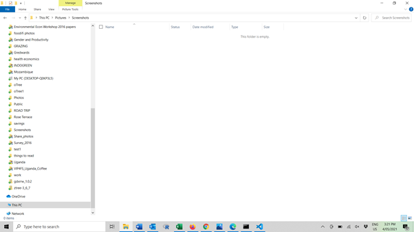

  # New readme

  ## Badges:
  

  ## Author
  github.com/spaniel-boone
  
  ## Description
  Not much, really

  ## Table of Contents
  - [Installation](#installation)
  - [Usage](#usage)
  - [Credits](#credits)
  - [License](#license)
  - [Features](#features)

  ## Installation
  no instructions needed

  ## Usage
  just work it out yourself!
  

  ## Credits
  undefined
  
  ## License
  GNU General Public License v3.0
  https://img.shields.io/badge/License-GPLv3-blue.svg

  ## Features
  no particularly interesting features

  ## Contact
  undefined
